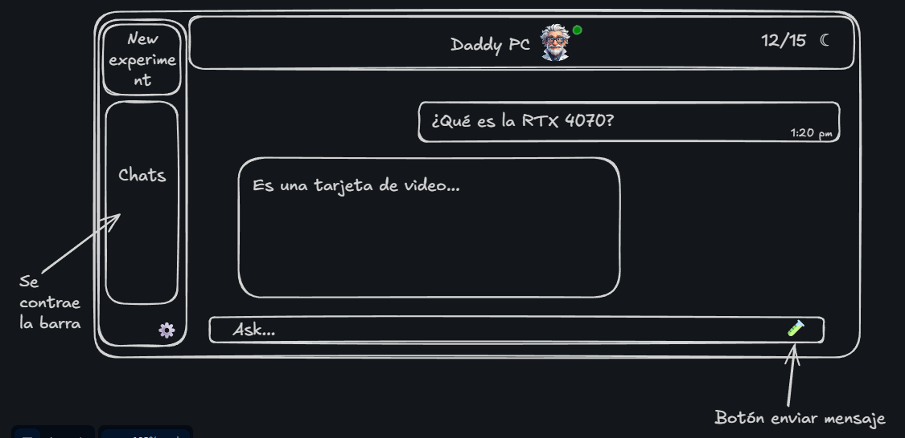

# Daddy Sr.PC — Frontend del Chat: Arquitectura y Diseño

**Proyecto:** Vista de Chat (App Real) — Agente de IA especializado en armado de PC
**Versión:** 1.0
**Fecha:** Junio 2026
**Stack real:** Angular 21 · Standalone Components · Signals · OnPush · Transloco · CSS Variables
**Documento base:** [`daddy-srpc-design-plan_1.md`](./daddy-srpc-design-plan_1.md) §6
**Prototipo:**  · Logo: 

> Este documento **profundiza y aterriza** la sección §6 del plan general específicamente
> para la pantalla de chat. Donde el plan general describe *qué* queremos, aquí definimos
> *cómo* se construye en el código real (componentes, signals, tokens y animaciones CSS),
> respetando las convenciones ya presentes en `src/` (señales, `OnPush`,
> `IntersectionObserver`, `prefers-reduced-motion`, tokens de `styles.scss`).

---

## 0. Índice

1. Concepto de la pantalla de Chat
2. Anatomía del layout (regiones y grid)
3. **Fondo de cuadrícula animada** (la firma visual del chat)
4. Sistema de tokens específicos del chat
5. Arquitectura de componentes Angular
6. Modelo de estado (signals y servicios)
7. Componentes en detalle (API, plantilla, estilos)
8. Animaciones y microinteracciones
9. Responsive y comportamiento del sidebar
10. Accesibilidad
11. Performance
12. Estructura de archivos y handoff de implementación

---

## 1. Concepto de la pantalla de Chat

El chat es **"la mesa de trabajo en vivo"**: una superficie donde Daddy responde mientras,
por detrás, late una **cuadrícula de PCB** — la placa sobre la que se "montan" los mensajes.
La cuadrícula no es decoración plana: **respira y deriva muy sutilmente**, dando sensación de
un sistema encendido sin robar atención a la conversación.

Tres principios rectores:

1. **El contenido manda.** El fondo vive en una capa `z-index` negativa, con opacidad baja y
   `pointer-events: none`. Nunca compite con el texto (contraste AA garantizado).
2. **Movimiento orgánico, no llamativo.** Deriva lenta (20–30 s por ciclo), `ease-in-out`,
   amplitudes de pocos píxeles. Se apaga por completo con `prefers-reduced-motion`.
3. **Coherencia con la marca PCB.** Reutiliza los mismos tokens (`--trace`, `--solder`,
   `--glass-border`) y la misma trama de 40px que ya usa `body::before` en `styles.scss`,
   pero la lleva a un nivel superior con paralaje y glow de nodos.

Referencia del layout (del prototipo `StyleChat.png`): sidebar izquierdo colapsable
("New experiment" + lista de chats + settings), header con avatar de Daddy + contador
`12/15` + toggle de tema, área de mensajes y barra de entrada con botón de envío.

---

## 2. Anatomía del layout

```
┌──────────────────────────────────────────────────────────────────────────┐
│  app-chat-shell  (CSS Grid:  [sidebar] [main] )                           │
│ ┌───────────┐ ┌──────────────────────────────────────────────────────┐   │
│ │ SIDEBAR   │ │ HEADER  Daddy Sr.PC 🧑‍🔧●        12/15    ☾          │   │
│ │           │ ├──────────────────────────────────────────────────────┤   │
│ │ + Nuevo   │ │                                                      │   │
│ │   chat    │ │   ╔═ MESSAGES (scroll) ════════════════════════════╗ │   │
│ │           │ │   ║                          ┌─ user bubble ─┐    ║ │   │
│ │ Chats     │ │   ║                          │ ¿RTX 4070?    │    ║ │   │
│ │ recientes │ │   ║   ┌─ agent bubble ───────────────────┐       ║ │   │
│ │  · ...    │ │   ║   │ Es una tarjeta de video...        │       ║ │   │
│ │  · ...    │ │   ║   │ [tabla / lista / warning / mono]  │       ║ │   │
│ │           │ │   ║   └───────────────────────────────────┘       ║ │   │
│ │           │ │   ╚══════════════════════════════════════════════╝ │   │
│ │  ⚙ ajustes│ │ ┌─ COMPOSER ─────────────────────────────────────┐  │   │
│ └───────────┘ │ │ [↹ nivel ▾] [ Ask...                    ] [ → ] │  │   │
│               │ └────────────────────────────────────────────────┘  │   │
│               └──────────────────────────────────────────────────────┘   │
│  · · · · · · · · · ·  capa de FONDO: cuadrícula animada (z-index: -1) · · │
└──────────────────────────────────────────────────────────────────────────┘
```

### Grid raíz (`app-chat-shell`)

```css
.chat-shell {
  display: grid;
  grid-template-columns: var(--sidebar-w, 264px) 1fr;
  grid-template-rows: 100dvh;        /* alto de viewport estable en móvil */
  overflow: hidden;                  /* el scroll vive dentro de .messages */
}
.chat-shell[data-sidebar='collapsed'] { --sidebar-w: 76px; }
```

El `main` es a su vez una sub-grid de tres filas: `auto` (header) · `1fr` (mensajes, único
scroll) · `auto` (composer).

```css
.chat-main {
  display: grid;
  grid-template-rows: auto 1fr auto;
  min-height: 0;          /* permite que .messages encoja y haga scroll */
  position: relative;     /* contexto de apilamiento para el fondo */
}
```

---

## 3. Fondo de cuadrícula animada — *la firma del chat*

Este es el corazón del pedido: **una cuadrícula detrás del chat que se mueve sutilmente.**
Se implementa como un componente dedicado `app-chat-grid` que vive en una capa de fondo
(`position: absolute; inset: 0; z-index: -1; pointer-events: none`) dentro de `.chat-main`.

### 3.1 Composición en tres capas (paralaje)

| Capa | Qué es | Movimiento | Token |
|---|---|---|---|
| **Grid fina** | Líneas cada `40px` (igual que `body::before`) | Deriva diagonal lenta, 26s | `--glass-border` |
| **Grid gruesa** | Líneas cada `160px` (4× la fina) | Deriva opuesta, 38s (paralaje) | `--trace` @ 6% |
| **Nodos / glow** | Puntos cian en intersecciones clave que "respiran" | Pulso de opacidad, 8s | `--trace`, `--solder` |

El **paralaje** nace de que las dos rejillas derivan a distinta velocidad y dirección: el ojo
percibe profundidad sin que nada se mueva de forma evidente.

### 3.2 Implementación CSS (puro, sin JS por defecto)

La versión por defecto es **100% CSS** (cero costo de JS, sin reflow): dos gradientes lineales
repetidos animados vía `background-position`, más una capa de puntos radiales para los nodos.

```scss
/* chat-grid.scss — capa de fondo del chat */
:host {
  position: absolute;
  inset: 0;
  z-index: -1;
  pointer-events: none;
  overflow: hidden;
  /* Vignette: la rejilla se desvanece hacia los bordes para no “cortar” */
  -webkit-mask-image: radial-gradient(120% 120% at 50% 40%, #000 55%, transparent 100%);
          mask-image: radial-gradient(120% 120% at 50% 40%, #000 55%, transparent 100%);
}

/* --- Capa 1: rejilla fina (40px) --- */
.grid-fine,
.grid-coarse,
.grid-nodes {
  position: absolute;
  inset: -10%;            /* sobredimensionada: la deriva nunca muestra bordes */
  background-repeat: repeat;
}

.grid-fine {
  background-image:
    linear-gradient(var(--glass-border) 1px, transparent 1px),
    linear-gradient(90deg, var(--glass-border) 1px, transparent 1px);
  background-size: 40px 40px;
  opacity: 0.45;
  animation: grid-drift-a 26s linear infinite;
}

/* --- Capa 2: rejilla gruesa (160px), paralaje en sentido inverso --- */
.grid-coarse {
  background-image:
    linear-gradient(color-mix(in srgb, var(--trace) 22%, transparent) 1.5px, transparent 1.5px),
    linear-gradient(90deg, color-mix(in srgb, var(--trace) 22%, transparent) 1.5px, transparent 1.5px);
  background-size: 160px 160px;
  opacity: 0.28;
  animation: grid-drift-b 38s linear infinite;
}

/* --- Capa 3: nodos que respiran en las intersecciones --- */
.grid-nodes {
  background-image:
    radial-gradient(circle, var(--trace) 0 1.6px, transparent 2px);
  background-size: 160px 160px;
  background-position: 80px 80px;      /* centrados sobre la rejilla gruesa */
  opacity: 0.16;
  animation: node-breathe 8s ease-in-out infinite;
  filter: drop-shadow(0 0 3px color-mix(in srgb, var(--trace) 60%, transparent));
}

/* Glow ambiental que “late” detrás de todo (solder + trace) */
:host::after {
  content: '';
  position: absolute;
  inset: 0;
  background:
    radial-gradient(680px circle at 78% 8%,  var(--solder-tint), transparent 60%),
    radial-gradient(560px circle at 8% 92%,  var(--trace-tint),  transparent 60%);
  opacity: 0.7;
  animation: glow-pulse-bg 14s ease-in-out infinite alternate;
}

/* ---------- Keyframes ---------- */
@keyframes grid-drift-a {        /* deriva diagonal suave */
  from { transform: translate3d(0, 0, 0); }
  to   { transform: translate3d(40px, 40px, 0); }   /* 1 celda → loop perfecto */
}
@keyframes grid-drift-b {        /* sentido opuesto + más lento = paralaje */
  from { transform: translate3d(0, 0, 0); }
  to   { transform: translate3d(-160px, -80px, 0); }
}
@keyframes node-breathe {
  0%, 100% { opacity: 0.10; }
  50%      { opacity: 0.22; }
}
@keyframes glow-pulse-bg {
  from { opacity: 0.55; transform: scale(1); }
  to   { opacity: 0.80; transform: scale(1.04); }
}
```

> **Nota de loop perfecto:** animar `transform: translate` por exactamente *una celda*
> (`40px` en la fina, `160px` en la gruesa) hace que el patrón se reinicie sin salto visible.
> Usamos `transform` en lugar de `background-position` para mantener la animación en el
> **compositor** (GPU), sin repintar.

### 3.3 Parallax reactivo al puntero (opcional, progresivo)

Para un toque "vivo" extra en desktop, el componente puede desplazar levísimamente las capas
según la posición del cursor. Es **opcional, throttleado con `requestAnimationFrame`** y se
desactiva en touch y bajo `prefers-reduced-motion`. Escribe variables CSS que las capas leen:

```ts
// chat-grid.ts (extracto del handler de puntero)
@HostListener('window:pointermove', ['$event'])
onPointerMove(e: PointerEvent): void {
  if (this.reducedMotion || e.pointerType !== 'mouse') return;
  if (this.rafId) return;                       // throttle a 1/frame
  this.rafId = requestAnimationFrame(() => {
    const x = (e.clientX / innerWidth - 0.5);   // -0.5 .. 0.5
    const y = (e.clientY / innerHeight - 0.5);
    const host = this.el.nativeElement as HTMLElement;
    host.style.setProperty('--px', `${x * 12}px`);   // fina: 12px máx
    host.style.setProperty('--py', `${y * 12}px`);
    host.style.setProperty('--px2', `${x * -22}px`); // gruesa: paralaje inverso
    host.style.setProperty('--py2', `${y * -22}px`);
    this.rafId = 0;
  });
}
```

```css
/* Las capas combinan la deriva (animation) con el offset de puntero (translate var) */
.grid-fine   { translate: var(--px, 0) var(--py, 0); transition: translate .25s var(--ease); }
.grid-coarse { translate: var(--px2, 0) var(--py2, 0); transition: translate .35s var(--ease); }
```

### 3.4 Variante WebGL/Canvas (futuro, NO requerida)

Si en el futuro se quiere una rejilla con perspectiva 3D o partículas que viajan por los
"traces", se encapsula tras la misma API del componente (`<app-chat-grid />`) sustituyendo el
`<svg>/<div>` por un `<canvas>`. El resto de la app no cambia. **Para v1 NO se usa**: el CSS
puro cumple el requisito con cero deuda de performance.

### 3.5 Apagado por accesibilidad

```css
@media (prefers-reduced-motion: reduce) {
  .grid-fine, .grid-coarse, .grid-nodes, :host::after { animation: none; }
  .grid-nodes { opacity: 0.14; }     /* queda estática, visible pero quieta */
}
```

---

## 4. Tokens específicos del chat

Se añaden a `:root` en `styles.scss` (o en un parcial `_chat.scss`), reutilizando la paleta ya
existente. **No se inventan colores nuevos**: se derivan de los tokens del plan §2.

```css
:root {
  /* Layout */
  --sidebar-w: 264px;
  --sidebar-w-collapsed: 76px;
  --composer-h: 64px;
  --bubble-max: 720px;          /* ancho máximo legible de una burbuja */

  /* Burbujas */
  --bubble-user-bg: var(--trace-tint);
  --bubble-user-border: color-mix(in srgb, var(--trace) 35%, transparent);
  --bubble-agent-bg: var(--glass-surface);
  --bubble-agent-border: var(--glass-border);
  --bubble-radius: 16px;

  /* Composer / superficies glass */
  --composer-bg: var(--glass-elevated);
  --rail-bg: var(--glass-surface);
}
```

El chat se apoya fuerte en el **glassmorphism sutil** que ya está definido (`--glass-surface`,
`--glass-elevated`, `--glass-border`, `--blur`) para que las superficies dejen entrever la
cuadrícula del fondo.

---

## 5. Arquitectura de componentes Angular

Todos **standalone**, `ChangeDetectionStrategy.OnPush`, con `signal()` para estado y
`inject()` para dependencias — idéntico a `hero.ts` / `live-demo.ts` ya existentes.

```
src/app/chat/
├── chat.ts                     # ChatPage — shell + orquestación (route /chat)
├── chat.html
├── chat.scss
├── chat-grid/
│   ├── chat-grid.ts            # ChatGrid — fondo de cuadrícula animada (§3)
│   └── chat-grid.scss
├── sidebar/
│   ├── chat-sidebar.ts         # ChatSidebar — lista de chats + nuevo + colapso
│   ├── chat-sidebar.html
│   └── chat-sidebar.scss
├── header/
│   ├── chat-header.ts          # ChatHeader — avatar, contador, theme toggle
│   ├── chat-header.html
│   └── chat-header.scss
├── message-list/
│   ├── message-list.ts         # MessageList — render + autoscroll
│   ├── message-list.html
│   └── message-list.scss
├── message/
│   ├── chat-message.ts         # ChatMessage — una burbuja (user|agent)
│   ├── chat-message.html
│   └── chat-message.scss
├── message-blocks/             # bloques estructurados de respuesta del agente
│   ├── spec-table.ts           #   tabla de compatibilidad
│   ├── admonition.ts           #   warning en cobre (--alert)
│   └── code-block.ts           #   specs en mono
├── composer/
│   ├── chat-composer.ts        # ChatComposer — textarea + nivel + enviar
│   ├── chat-composer.html
│   └── chat-composer.scss
├── typing-indicator/
│   └── typing-indicator.ts     # TypingIndicator — “Daddy está escribiendo…”
└── gate/
    └── register-gate.ts        # RegisterGate — overlay al llegar a 0/15
```

### Servicios (`src/app/chat/state/`)

```
state/
├── chat-store.ts               # ChatStore — estado de conversaciones (signals)
├── request-counter.service.ts  # RequestCounter — los 15 requests (plan §5)
└── chat-api.ts                 # ChatApi — fachada HTTP (mockeable; SSE/stream)
```

### Diagrama de composición

```
ChatPage (route '/chat')
├── ChatGrid                     ← fondo animado (capa -1)
├── ChatSidebar
│   └── (lista de ConversationSummary)
└── ChatMain
    ├── ChatHeader               ← usa RequestCounter + ThemeService
    ├── MessageList
    │   ├── ChatMessage[]        ← user / agent
    │   │   └── (SpecTable | Admonition | CodeBlock)*
    │   └── TypingIndicator      ← visible cuando store.typing()
    ├── ChatComposer             ← emite (send) y (levelChange)
    └── RegisterGate             ← @if (counter.depleted())
```

### Ruta (añadir a `app.routes.ts`)

Sigue el patrón de lazy-loading ya usado para `landing`, `login`, `register`:

```ts
{
  path: 'chat',
  loadComponent: () => import('./chat/chat').then((m) => m.ChatPage),
},
```

---

## 6. Modelo de estado (signals y servicios)

### 6.1 Tipos de dominio

```ts
export type Role = 'user' | 'agent';
export type Level = 'novato' | 'intermedio' | 'avanzado';   // ya usado en live-demo

export type MessageBlock =
  | { kind: 'text'; text: string }
  | { kind: 'table'; head: string[]; rows: string[][] }
  | { kind: 'admonition'; tone: 'warn' | 'info'; text: string }
  | { kind: 'code'; lang: string; code: string };

export interface ChatMessage {
  id: string;
  role: Role;
  blocks: MessageBlock[];      // el agente responde en bloques estructurados (plan §6.3)
  createdAt: number;
  pending?: boolean;           // true mientras llega el stream
}

export interface Conversation {
  id: string;
  title: string;
  messages: ChatMessage[];
  updatedAt: number;
}
```

### 6.2 `ChatStore` (estado con signals)

```ts
@Injectable({ providedIn: 'root' })
export class ChatStore {
  private readonly _conversations = signal<Conversation[]>([]);
  private readonly _activeId = signal<string | null>(null);
  readonly typing = signal(false);
  readonly level = signal<Level>('intermedio');

  readonly conversations = this._conversations.asReadonly();
  readonly active = computed(() =>
    this._conversations().find((c) => c.id === this._activeId()) ?? null,
  );
  readonly messages = computed(() => this.active()?.messages ?? []);

  newConversation(): void { /* crea, setActive, persiste */ }
  setActive(id: string): void { this._activeId.set(id); }
  appendUser(text: string): void { /* push mensaje user */ }
  appendAgentChunk(id: string, chunk: string): void { /* streaming */ }
  setLevel(l: Level): void { this.level.set(l); }
}
```

Razones de diseño:
- **Signals + `computed`** → render derivado y `OnPush` sin `async` pipes.
- **`active()` derivado** → no duplicamos la "conversación activa"; siempre es función del id.
- Persistencia opcional vía `effect()` a `localStorage` (mismo patrón que `ThemeService`).

### 6.3 `RequestCounter` (los 15 requests — plan §5)

Extrae a un servicio la lógica que hoy vive inline en `live-demo.ts`, reutilizable por landing
y chat:

```ts
@Injectable({ providedIn: 'root' })
export class RequestCounter {
  readonly total = 15;
  readonly remaining = signal(this.total);

  /** 'none' | 'soft' (≤5) | 'strong' (==1)  → estados de aviso del plan §5.2 */
  readonly notice = computed<'none' | 'soft' | 'strong'>(() => {
    const r = this.remaining();
    if (r === 1) return 'strong';
    if (r <= 5 && r > 0) return 'soft';
    return 'none';
  });
  readonly depleted = computed(() => this.remaining() === 0);

  consume(): boolean {
    if (this.remaining() === 0) return false;
    this.remaining.update((r) => r - 1);
    return true;
  }
  reset(): void { this.remaining.set(this.total); }
}
```

### 6.4 `ChatApi` (fachada, streaming)

Fachada HTTP mockeable. v1 puede devolver respuestas simuladas (como `live-demo`); la firma ya
contempla **streaming** (SSE / `ReadableStream`) para el efecto auto-typing real:

```ts
@Injectable({ providedIn: 'root' })
export class ChatApi {
  /** Emite chunks de texto a medida que el agente "escribe". */
  stream(input: { text: string; level: Level }): Observable<string> { /* ... */ }
}
```

---

## 7. Componentes en detalle

### 7.1 `ChatPage` (shell)

Orquesta: instancia el fondo, conecta `ChatComposer.send` → `ChatStore` + `RequestCounter`,
abre el `RegisterGate` cuando `counter.depleted()`.

```ts
@Component({
  selector: 'app-chat',
  changeDetection: ChangeDetectionStrategy.OnPush,
  imports: [ChatGrid, ChatSidebar, ChatHeader, MessageList, ChatComposer, RegisterGate],
  templateUrl: './chat.html',
  styleUrl: './chat.scss',
})
export class ChatPage {
  protected readonly store = inject(ChatStore);
  protected readonly counter = inject(RequestCounter);
  protected readonly sidebarCollapsed = signal(false);

  onSend(text: string): void {
    if (!this.counter.consume()) return;       // gate cuando 0
    this.store.appendUser(text);
    this.store.streamReply(text);              // usa ChatApi internamente
  }
}
```

```html
<!-- chat.html -->
<div class="chat-shell" [attr.data-sidebar]="sidebarCollapsed() ? 'collapsed' : 'expanded'">
  <app-chat-sidebar
    [collapsed]="sidebarCollapsed()"
    (toggle)="sidebarCollapsed.set(!sidebarCollapsed())" />

  <main class="chat-main">
    <app-chat-grid />                           <!-- §3: fondo animado -->
    <app-chat-header />
    <app-message-list [messages]="store.messages()" [typing]="store.typing()" />
    <app-chat-composer
      [disabled]="counter.depleted()"
      (send)="onSend($event)"
      (levelChange)="store.setLevel($event)" />

    @if (counter.depleted()) {
      <app-register-gate />
    }
  </main>
</div>
```

### 7.2 `ChatMessage` (burbuja)

`input()` con la data; render condicional por `block.kind` usando el control-flow nativo
(`@switch`). Animación de entrada `fade-up` (keyframe ya existente en `styles.scss`).

```ts
@Component({
  selector: 'app-chat-message',
  changeDetection: ChangeDetectionStrategy.OnPush,
  imports: [SpecTable, Admonition, CodeBlock],
  templateUrl: './chat-message.html',
  styleUrl: './chat-message.scss',
})
export class ChatMessage {
  readonly message = input.required<ChatMessage>();
}
```

```html
<!-- chat-message.html -->
<article class="bubble" [class.bubble--user]="message().role === 'user'"
                        [class.bubble--agent]="message().role === 'agent'">
  @for (block of message().blocks; track $index) {
    @switch (block.kind) {
      @case ('text')       { <p>{{ block.text }}</p> }
      @case ('table')      { <app-spec-table [data]="block" /> }
      @case ('admonition') { <app-admonition [data]="block" /> }
      @case ('code')       { <app-code-block [data]="block" /> }
    }
  }
</article>
```

```scss
/* chat-message.scss — burbujas con glass para dejar ver la rejilla */
.bubble {
  max-width: var(--bubble-max);
  padding: 0.875rem 1.125rem;
  border-radius: var(--bubble-radius);
  border: 1px solid var(--glass-border);
  backdrop-filter: blur(var(--blur));
  animation: fade-up 0.4s var(--ease) both;     /* keyframe de styles.scss */
}
.bubble--user {
  margin-left: auto;                            /* alineado a la derecha (prototipo) */
  background: var(--bubble-user-bg);
  border-color: var(--bubble-user-border);
  border-bottom-right-radius: 4px;              /* “cola” hacia el emisor */
}
.bubble--agent {
  margin-right: auto;
  background: var(--bubble-agent-bg);
  border-bottom-left-radius: 4px;
}
```

### 7.3 `MessageList` (autoscroll)

Reusa el patrón de `live-demo.ts`: `viewChild` del contenedor + scroll al fondo tras cada
cambio. Se hace con un `effect()` que observa `messages()`:

```ts
export class MessageList {
  readonly messages = input.required<ChatMessage[]>();
  readonly typing = input(false);
  private readonly scroller = viewChild<ElementRef<HTMLElement>>('scroller');

  constructor() {
    effect(() => {
      this.messages();                                   // dependencia
      queueMicrotask(() => {
        const el = this.scroller()?.nativeElement;
        if (el) el.scrollTop = el.scrollHeight;
      });
    });
  }
}
```

### 7.4 `ChatComposer`

Textarea autogrow + selector de nivel (chips `novato | intermedio | avanzado`, ya tipados) +
botón enviar. Enter envía, Shift+Enter = nueva línea. Emite `send` y `levelChange`.

```ts
export class ChatComposer {
  readonly disabled = input(false);
  readonly send = output<string>();
  readonly levelChange = output<Level>();
  protected readonly draft = signal('');
  protected readonly levels: Level[] = ['novato', 'intermedio', 'avanzado'];

  submit(): void {
    const text = this.draft().trim();
    if (!text || this.disabled()) return;
    this.send.emit(text);
    this.draft.set('');
  }
  onKeydown(e: KeyboardEvent): void {
    if (e.key === 'Enter' && !e.shiftKey) { e.preventDefault(); this.submit(); }
  }
}
```

Estilo del botón de envío: reutiliza `.btn--primary` (solder) del sistema global; en estado
`typing` muestra un spinner; en éxito hace el morph `ícono → check` (plan §3 microinteracción 3).

### 7.5 `TypingIndicator`

Tres puntos que rebotan en cian (`--trace`), visible mientras `store.typing()`:

```scss
.dot { width: 6px; height: 6px; border-radius: 50%; background: var(--trace);
       animation: typing-bounce 1.2s ease-in-out infinite; }
.dot:nth-child(2) { animation-delay: 0.15s; }
.dot:nth-child(3) { animation-delay: 0.30s; }
@keyframes typing-bounce { 0%,60%,100% { transform: translateY(0); opacity:.5; }
                           30% { transform: translateY(-4px); opacity:1; } }
```

### 7.6 `RegisterGate`

Overlay invitador (plan §5.3, tono "seguí preguntando") cuando `counter.depleted()`. Fondo con
`backdrop-filter`, foco atrapado, `Esc` cierra (vuelve al chat en estado bloqueado).

---

## 8. Animaciones y microinteracciones

| # | Evento | Efecto | Implementación |
|---|---|---|---|
| 1 | Fondo en reposo | Cuadrícula deriva + nodos respiran | CSS `transform`/opacity (§3) |
| 2 | Mover el ratón (desktop) | Paralaje sutil de las rejillas | `pointermove` + vars CSS (§3.3) |
| 3 | Nuevo mensaje | Burbuja entra con `fade-up` | keyframe `fade-up` global |
| 4 | Agente responde | Auto-typing por chunks (stream) | `ChatApi.stream` + signal |
| 5 | "Daddy escribe…" | Tres puntos rebotando | `typing-bounce` |
| 6 | Enviar | `→` morfea a `✓`, luego limpia input | clase `.is-sent` temporal |
| 7 | Contador baja | `15 → 14` transición suave, `aria-live` | `transition` + `role="status"` |
| 8 | Aviso 5/1 | Banner suave/cálido con `pulse` | `notice()` computed + `glow-pulse` |
| 9 | Colapsar sidebar | Ancho anima `264 → 76px` | `transition: grid-template-columns` |
| 10 | Hover en chat del sidebar | Borde cian + `bg-elevated` | tokens hover del plan §10.3 |

Todas las animaciones **heredan los easings globales** (`--ease`, `--t-fast`, `--t-normal`) y se
neutralizan bajo `prefers-reduced-motion` por el bloque global ya presente en `styles.scss`.

---

## 9. Responsive y sidebar

Breakpoints del plan §7.1 (`640` / `1024`).

| Rango | Sidebar | Fondo (cuadrícula) | Burbujas |
|---|---|---|---|
| **Desktop ≥1025px** | Visible, colapsable a 76px | Completo + paralaje de puntero | `max-width: var(--bubble-max)` |
| **Tablet 641–1024px** | Colapsado por defecto, abre como overlay | Completo, sin paralaje de puntero | full-fluid |
| **Móvil ≤640px** | Off-canvas (drawer con backdrop) | Solo deriva lenta; **sin** paralaje ni glow pesado | ocupan ~92% del ancho |

```css
@media (max-width: 1024px) {
  .chat-shell { grid-template-columns: 1fr; }      /* sidebar sale del flujo */
  .chat-sidebar { position: fixed; inset-block: 0; inset-inline-start: 0;
                  transform: translateX(-100%); transition: transform var(--t-normal) var(--ease); }
  .chat-shell[data-sidebar='expanded'] .chat-sidebar { transform: none; }
}
@media (max-width: 640px) {
  .grid-coarse, :host(app-chat-grid)::after { display: none; }   /* aligera el fondo */
}
```

El `dvh` (`100dvh`) evita el salto de la barra de URL móvil; el único scroll es `.messages`.

---

## 10. Accesibilidad (plan §8)

- **Estructura semántica:** `<aside>` sidebar, `<main>` chat, `<article>` por mensaje,
  `<form>` en el composer con `<label>` para el textarea y el selector de nivel.
- **`aria-live`:** la región de mensajes nuevos del agente usa `aria-live="polite"`; el contador
  `12/15` usa `role="status"` + `aria-live="polite"` (anuncia "Quedan N preguntas").
- **Foco:** anillo cian 2px (`:focus-visible` global). El `RegisterGate` **atrapa el foco** y lo
  restaura al cerrar. El drawer del sidebar también.
- **Teclado:** Enter envía, Shift+Enter salto de línea, `Esc` cierra gate/drawer, Tab recorre
  sidebar → header → mensajes → composer en orden lógico.
- **Contraste:** burbujas y texto verificados AA (≥4.5:1) en dark y light. La cuadrícula del
  fondo está a opacidad ≤0.45 sobre `--bg-base`, sin tocar el contraste del texto (vive en capa
  `z-index:-1`).
- **El fondo decorativo** lleva `aria-hidden="true"` y `pointer-events: none`.
- **Movimiento:** todo lo de §3 se detiene con `prefers-reduced-motion`; el auto-typing pasa a
  revelar el mensaje completo (mismo criterio que `hero.ts`/`live-demo.ts`).

---

## 11. Performance

- **Fondo sin JS por defecto** → cero trabajo en el hilo principal; animaciones de `transform`
  y `opacity` corren en el **compositor** (GPU). El paralaje de puntero es opcional, throttleado
  a 1 update por frame con `requestAnimationFrame` y sólo `mouse`.
- **`will-change: transform`** sólo en las tres capas del grid (no en todo el árbol).
- **`OnPush` + signals** en todos los componentes → re-render mínimo y dirigido.
- **`@for` con `track`** en listas de mensajes y chats para reconciliación estable.
- **Lazy load** de la ruta `/chat` (igual que el resto) → no penaliza el landing.
- **Streaming** de la respuesta: el usuario ve texto al instante (mejor LCP percibido) en vez de
  esperar el mensaje completo.
- **Sin imágenes pesadas** en el fondo: todo es gradientes CSS (cacheables, escalables).

Objetivos (plan §9): FCP <2s, CLS <0.1 (el grid raíz reserva el layout desde el primer frame).

---

## 12. Estructura de archivos y handoff

### 12.1 Archivos nuevos

```
src/app/chat/**            → componentes (§5)
src/app/chat/state/**      → ChatStore, RequestCounter, ChatApi (§6)
src/styles/_chat.scss      → tokens del chat (§4)  [o añadir a styles.scss]
```

### 12.2 Cambios en archivos existentes

- `src/app/app.routes.ts` → añadir ruta lazy `/chat` (§5).
- `src/styles.scss` → importar tokens del chat (§4); las animaciones reutilizan keyframes ya
  presentes (`fade-up`, `glow-pulse`, `float`).
- i18n Transloco → nuevas claves `chat.*` (header, composer, niveles, gate, avisos del contador),
  en `es` y `en`, siguiendo el patrón de `hero.*` / `demo.*`.

### 12.3 Orden de implementación sugerido

1. **Tokens + `ChatGrid`** (§3, §4) — el fondo animado, verificable en aislamiento.
2. **Shell + layout** (`ChatPage`, grid raíz, header, sidebar estáticos).
3. **Estado** (`ChatStore`, `RequestCounter`) + `MessageList`/`ChatMessage` con data mock.
4. **Composer** (envío, niveles, autogrow, teclado).
5. **Streaming** (`ChatApi.stream`) + `TypingIndicator` (auto-typing real).
6. **Bloques estructurados** (`SpecTable`, `Admonition`, `CodeBlock`).
7. **Gate de registro** + avisos del contador (5/1/0).
8. **Responsive** (drawer móvil) + **pase de accesibilidad** + `prefers-reduced-motion`.

### 12.4 Checklist de aceptación (QA)

- [ ] La cuadrícula del fondo deriva de forma **perceptible pero no distractora** (loop sin salto).
- [ ] Paralaje de puntero suave en desktop; **ausente** en touch y `reduced-motion`.
- [ ] Burbujas user (derecha, trace) y agent (izquierda, glass) según prototipo.
- [ ] Contador `N/15` anunciado por `aria-live`; avisos en 5 y 1; gate en 0.
- [ ] Sidebar colapsa en desktop y es drawer en móvil (foco atrapado).
- [ ] Auto-typing por stream; cae a "mensaje completo" con `reduced-motion`.
- [ ] Contraste AA del texto sobre el fondo animado en dark **y** light.
- [ ] FCP <2s, CLS <0.1; animaciones del fondo en compositor (sin repintura).

---

**Versión:** 1.0
**Última revisión:** Junio 2026
**Status:** 🟢 Ready for Development Handoff (Chat Frontend)
**Relación:** complementa y detalla §6 de `daddy-srpc-design-plan_1.md`.
