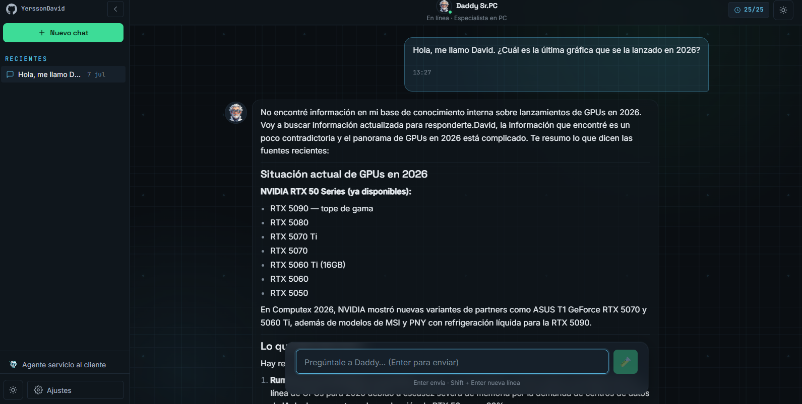
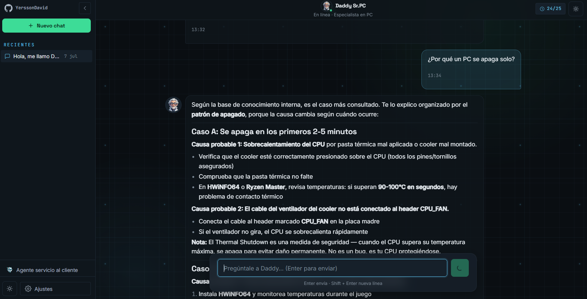
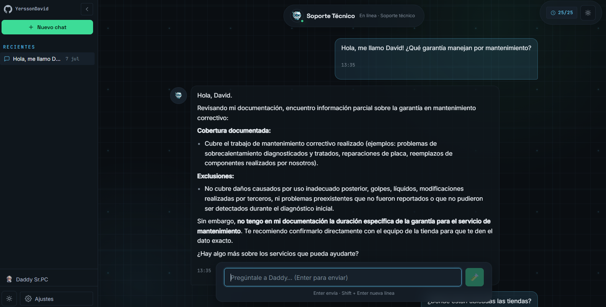
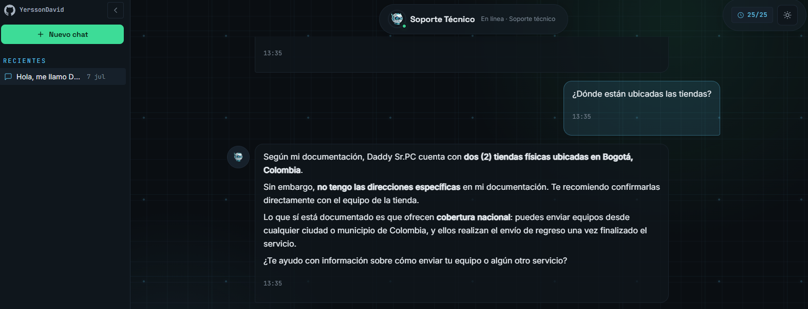
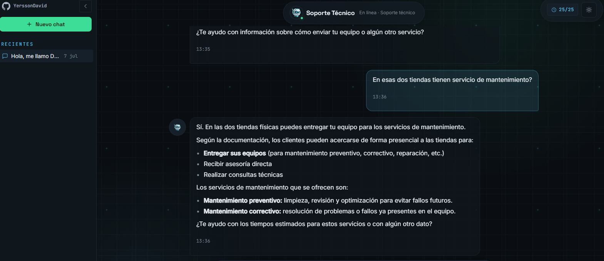
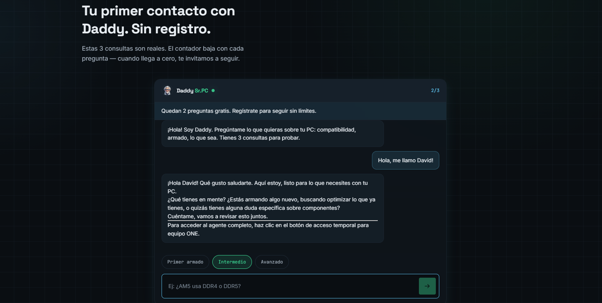

<div align="center">


# Daddy Sr.PC

### Tu agente de IA especializado en PC Hardware

[](https://daddypc.up-x.me/)

Un agente de inteligencia artificial que te **acompaña, guía y resuelve** todo lo que necesites saber sobre hardware, compatibilidad, ensamblaje, marcas y mucho más — con respuestas precisas, personalizadas y en tiempo real.

<p>

[](LICENSE)
[](https://angular.dev)
[](https://spring.io/projects/spring-boot)
[](https://www.java.com)
[](https://www.typescriptlang.org)
[]()
[]()
[]()
[]()

</p>

<p>

**¿Te fue útil este proyecto?**

[](https://github.com/YerssonDavid/Daddy-Sr.PC-ONE/stargazers)
[](https://github.com/YerssonDavid/Daddy-Sr.PC-ONE/fork)

Una estrella ayuda al proyecto a llegar a más personas. ¡Gracias! 🙌

</p>

</div>

---

## ¿Qué es Daddy Sr.PC?

Daddy Sr.PC es un **agente de IA conversacional enfocado 100% en el ecosistema PC**.

No es un chatbot genérico. Es un Agente especializado que te acompaña durante todo el proceso: desde que tienes una duda sobre compatibilidad, hasta que encuentras el build perfecto para tu presupuesto. Daddy Sr.PC combina razonamiento profundo con información técnica actualizada para darte respuestas confiables y personalizadas.

Puede ayudarte con:

- **Ensamblaje de PC** — guías paso a paso, qué comprar primero, cómo instalar componentes
- **Compatibilidad** — CPU + Motherboard, RAM + plataforma, GPU + fuente de poder
- **Builds por presupuesto** — recomendaciones reales ajustadas a tu bolsillo y objetivo
- **Comparaciones de hardware** — CPUs, GPUs, SSDs, RAMs, fuentes, gabinetes
- **Troubleshooting** — PC que no enciende, crashes, temperaturas altas, pantalla azul
- **BIOS y drivers** — versiones, actualizaciones, configuraciones de XMP/EXPO
- **Overclocking y tuning** — estabilidad, voltajes, perfiles de memoria
- **Marcas y mercado** — qué marca elegir, reputación, relación precio-calidad
- **Preguntas frecuentes** — dudas comunes del mundo PC respondidas con precisión
- **PCs para gaming, workstation o uso general** — recomendaciones según tu uso real

---

## ¿Por qué es diferente?

La mayoría de los asistentes de IA responden preguntas de PC usando únicamente el conocimiento interno del modelo de lenguaje — que puede estar desactualizado o simplemente equivocado.

Daddy Sr.PC va mucho más lejos:

- Recupera documentación técnica actualizada mediante **RAG**
- Usa herramientas agénticas para acceder a **información en tiempo real**
- Mantiene **memoria de conversación** para personalizar cada respuesta según tu configuración actual
- Reduce significativamente las alucinaciones al combinar contexto recuperado con razonamiento

El resultado: respuestas más precisas, más honestas y más útiles.

---

## Ejemplos de preguntas que puedes hacer

```text
¿El RTX 5070 es compatible con un Ryzen 5 7600?

¿Qué fuente de poder necesito para esta build?

Mi PC se reinicia sola al jugar. ¿Qué puede ser?

Arma una PC para gaming 1440p con $1000 de presupuesto.

¿Cuál es mejor: RTX 5070 o RX 9070 XT?

¿Qué versión de BIOS soporta los Ryzen 9000?

¿Vale la pena el DDR5 sobre DDR4 en 2025?

¿Cómo activo XMP/EXPO en mi placa?

¿Qué diferencia hay entre un cooler de 120mm y uno de 240mm?

¿Cuál SSD tiene mejor relación precio-velocidad ahora mismo?
```

---

## ✨ Características principales

- 🤖 **Arquitectura agéntica** — el agente decide qué herramientas usar para cada consulta
- 📚 **RAG integrado** — recupera contexto técnico relevante antes de responder
- 🧠 **Memoria de conversación** — recuerda tu setup y preferencias a lo largo del chat
- 🌐 **Datos en tiempo real** — conectado a fuentes confiables de hardware
- 💬 **Conversación natural** — no necesitas saber tecnicismos para interactuar
- 🌍 **Multilenguaje** — Interfaz disponible en Español, Inglés y Portugués
- 📱 **PWA** — instalable como aplicación en cualquier dispositivo
- 🎨 **Tema claro/oscuro** — UI adaptable a tu preferencia

---

## 🧠 Cómo funciona

```text
         Pregunta del usuario
                │
                ▼
      Capa de planeación del agente
                │
      ┌─────────┴──────────┐
      │                    │
      ▼                    ▼
 Base de conocimiento   Herramientas agénticas
 (RAG + Vector DB)           │
      │              ┌──────┴──────┐
      │              │             │
      ▼              ▼             ▼
 Hardware DB    APIs confiables  Datos en vivo
      │
      └─────────────┬─────────────┘
                    ▼
          Generación de respuesta (LLM)
                    ▼
         Respuesta final personalizada
```

---

# Comparativa de Agentes — Daddy Sr.PC (Preview)

| Característica | Soporte Técnico (`/chat`) | Atención al Cliente (`/chat/support`) | Agente de Prueba (Página principal) |
|---|---|---|---|
| **Modelo** | GLM-5.0 | GLM-5.0 | Qwen3.5-9B |
| **Búsqueda web en tiempo real** | ✅ Sí | ❌ No | ✅ Sí |
| **Documentación técnica (RAG)** | ✅ Sí | ✅ Sí | ❌ No |
| **Memoria de conversación** | ✅ Sí | ✅ Sí | ❌ No |
| **Registro requerido** | ❌ No (acceso libre - Temporal) | ❌ No (acceso libre - Temporal) | ❌ No (acceso libre) |
| **Nivel de capacidades** | Máximo (agente principal) | Intermedio (enfocado en dudas empresariales) | Limitado (demo) |
| **Acceso ampliado** | Vía botón "Equipo ONE: probar agente completo | Vía botón "Equipo ONE: probar agente completo | -- |

**Notas:**
- El agente de soporte técnico es el más completo, combinando RAG + búsqueda web en tiempo real.
- El agente de atención al cliente está restringido únicamente a documentación empresarial vía RAG.
- El agente de prueba, disponible sin registro, usa un modelo más ligero (Qwen3.5-9B) y carece de memoria y RAG, aunque sí tiene búsqueda web en tiempo real.

>[!NOTE] Actualmente no se requiere registro para probar el modelo, puede acceder al modelo con más capacidades mediante el botón de `Equipo ONE: probar agente completo`. 

---
## Comprobante agentes

#### **Agente principal Sr.PC**


---


---

#### **Agente de servicio al cliente Sr.PC**


---


---


---

#### **Agente de prueba**


---

## 🛠️ Tech Stack

### Frontend

| Tecnología | Versión | Propósito |
|---|---|---|
| Angular | 21 | Framework principal |
| TypeScript | 5.9 | Tipado estático |
| Transloco | 8.4 | Internacionalización (i18n) |
| RxJS | 7.8 | Programación reactiva |
| Vitest | 4.x | Unit testing |
| ngx-markdown | 22 | Renderizado Markdown |
| PWA | — | Instalación y offline support |

### Backend

| Tecnología | Versión | Propósito |
|---|---|---|
| Java | 21 | Runtime del servidor |
| Spring Boot | 4.1.0 | Framework backend |
| Spring AI | 2.0.0 | Integración con LLMs y herramientas |
| Spring Security | — | Autenticación y autorización |
| Spring Data JPA | — | Persistencia y ORM |
| PostgreSQL + PgVector | — | Base de datos + búsqueda semántica |
| SiliconFlow API | — | LLM (GLM-5.0, Qwen3.5-9B) |
| Tavily API | — | Búsqueda web en tiempo real |

### Infraestructura de IA

| Componente | Propósito |
|---|---|
| Agentic AI | Planeación y ejecución de herramientas |
| RAG | Recuperación aumentada de conocimiento |
| Vector Database (PgVector) | Búsqueda semántica |
| Conversation Memory | Contexto persistente por sesión |
| Tool Calling | Acceso a datos externos en tiempo real |

### Infraestructura

| Componente | Propósito |
|---|---|
| Docker / Docker Compose | Contenedorización |
| Vercel | Hosting del frontend |
| GCP | Hosting del backend |
| OCI | Hosting de base de datos PostgreSQL |
| Doppler | Gestión de secretos |

## 🌐 Despliegue

| Componente | Plataforma |
|---|---|
| Frontend | [Vercel](https://vercel.com) — [`https://daddypc.up-x.me/`](https://daddypc.up-x.me/) |
| Backend | Google Cloud Platform (GCP) |
| Base de datos | Oracle Cloud Infrastructure (OCI) |

El backend en **GCP** y la base de datos en **OCI** se comunican a través de una **VPN privada**.

---

### Arquitectura del backend

El backend sigue **Arquitectura Hexagonal (Ports & Adapters)** con separación en tres capas:

| Capa | Propósito |
|---|---|
| `domain/` | Modelo de dominio y Value Objects |
| `application/` | Puertos de entrada/salida y casos de uso |
| `infraestructure/` | Adaptadores, controladores REST, persistencia JPA |

>[!NOTE] El backend está alojado en **GCP** y la base de datos en **OCI**, comunicándose a través de una **VPN privada**.

---

## 📦 Estructura del repositorio

```text
Daddy-Sr.PC-ONE/
├── img/                                  # Screenshots de los agentes
├── daddyPcBackend/                       # Backend — Spring Boot (Java 21)
│   ├── src/main/java/.../daddypcbackend/
│   │   ├── application/
│   │   │   ├── command/                  # Comandos CQRS
│   │   │   │   ├── assistant/            #   QuestionToAssistantCommand
│   │   │   │   └── user/                 #   CreateUserCommand, LoginUserCommand
│   │   │   ├── dto/                      # DTOs de respuesta
│   │   │   ├── port/
│   │   │   │   ├── in/                   # Puertos de entrada (interfaces)
│   │   │   │   │   ├── assistant/        #   IAssistantAI, IAssistantAIFree, IAssistantAISupport
│   │   │   │   │   └── user/             #   ILoginUser, IRegistryUser
│   │   │   │   └── out/                  # Puertos de salida (interfaces)
│   │   │   │       ├── assistant/        #   IAssistantAIClient, ITavilySearchTools
│   │   │   │       └── user/             #   IPasswordEncoder, IUserR
│   │   │   └── useCase/                  # Casos de uso
│   │   │       ├── assistant/            #   QuestionAiUseCase, QuestionAiSupport, QuestionToAssistantFree
│   │   │       └── user/                 #   LoginUserUseCase, RegistryUserUseCase
│   │   ├── domain/
│   │   │   ├── exception/                # InputDataInvalid
│   │   │   ├── model/                    # User (modelo de dominio)
│   │   │   └── valueObjects/             # EmailVO, PasswordVO, NameVO, etc.
│   │   └── infraestructure/
│   │       ├── adapter/                  # Implementaciones de puertos de salida
│   │       │   ├── assistant/            #   AssistantAIAdapter, TavilySearchToolsAdapter
│   │       │   └── user/                 #   PasswordEncoderAdapter, RegistryUserAdapter
│   │       ├── config/                   # Configuración Spring (AI, Security, PDF, Beans)
│   │       ├── persistence/user/         # Entidad JPA + repositorio
│   │       ├── service/pdf/              # Lector de PDFs para RAG
│   │       └── web/in/                   # Controladores REST
│   │           ├── assitant/             #   QuestionAssistantController, QuestionAssistantFreeController
│   │           └── user/                 #   LoginUserController, RegistryUserController
│   ├── src/main/resources/
│   │   ├── application.yaml             # Configuración base
│   │   ├── application-dev.yaml          # Configuración desarrollo
│   │   ├── application-prod.yaml         # Configuración producción
│   │   └── pdf/                          # Documentación técnica para RAG
│   ├── Dockerfile
│   ├── compose.yaml
│   ├── docker-compose.prod.yml
│   └── pom.xml
└── DaddySrPCFrontend/                    # Frontend — Angular 21
    ├── public/
    │   ├── i18n/                         # Traducciones (es, en, pt)
    │   ├── logo.png, style-chat.png      # Assets estáticos
    │   └── manifest.webmanifest          # PWA manifest
    ├── src/
    │   ├── app/
    │   │   ├── core/                     # Servicios globales (auth, theme, transloco)
    │   │   ├── landing/                  # Página principal (hero, features, live-demo, etc.)
    │   │   ├── chat/                     # Chat agéntico (composer, mensajes, sidebar, estado)
    │   │   ├── login/                    # Inicio de sesión
    │   │   ├── register/                 # Registro de usuarios
    │   │   └── shared/                   # Componentes reutilizables (theme-toggle, lang-selector, etc.)
    │   └── environments/                 # environment.ts / environment.prod.ts
    ├── angular.json
    ├── package.json
    └── vercel.json
```

---

## 🚀 Desarrollo local

### Requisitos

- Node.js 20+
- Java 21
- Docker (para base de datos PostgreSQL + PgVector)

### Frontend

```bash
# Clonar el repositorio
git clone https://github.com/YerssonDavid/Daddy-Sr.PC-ONE.git
cd Daddy-Sr.PC-ONE/DaddySrPCFrontend

# Instalar dependencias
npm install

# Iniciar servidor de desarrollo
ng serve
```

La aplicación estará disponible en `http://localhost:4200/`.

### Backend

```bash
cd daddyPcBackend

# Iniciar base de datos con Docker
docker compose up -d

# Ejecutar servidor (puerto 8080)
./mvnw spring-boot:run
```

### Comandos útiles

```bash
# Frontend — build de producción
cd DaddySrPCFrontend && ng build

# Frontend — unit tests
cd DaddySrPCFrontend && ng test

# Backend — empaquetar JAR
cd daddyPcBackend && ./mvnw package

# Backend — ejecutar tests
cd daddyPcBackend && ./mvnw test
```

---

## 🤝 Contribuir

¡Las contribuciones son bienvenidas!

1. Haz un **Fork** del repositorio
2. Crea una rama para tu feature: `git checkout -b feat/mi-feature`
3. Haz commit de tus cambios: `git commit -m "feat: descripción"`
4. Abre un **Pull Request**

Por favor, revisa las convenciones de commits antes de contribuir.

---

## ⭐ Apoya el proyecto

Si Daddy Sr.PC te fue útil o simplemente te parece un proyecto interesante:

| Acción | Por qué importa |
|---|---|
| ⭐ **[Dale una estrella](https://github.com/YerssonDavid/Daddy-Sr.PC-ONE/stargazers)** | Ayuda a que más personas lo descubran |
| 🍴 **[Haz un Fork](https://github.com/YerssonDavid/Daddy-Sr.PC-ONE/fork)** | Contribuye o adáptalo a tus necesidades |
| 🐞 **[Reporta un bug](https://github.com/YerssonDavid/Daddy-Sr.PC-ONE/issues)** | Ayúdanos a mejorar la calidad |
| 💡 **[Sugiere una feature](https://github.com/YerssonDavid/Daddy-Sr.PC-ONE/issues/new)** | Tu idea puede ser el próximo update |
| 📢 **Compártelo** | Cuéntale a alguien que lo necesite |

---

## 📄 Licencia

Este proyecto está licenciado bajo la **GNU Affero General Public License v3.0 (AGPL-3.0)**.

Esto significa que eres libre de usar, modificar y distribuir este software, siempre y cuando cualquier trabajo derivado también sea distribuido bajo la misma licencia — incluyendo el uso en servicios en red (SaaS).

Consulta el archivo [LICENSE](LICENSE) para más detalles.

---

<div align="center">

Hecho con ❤️ para la comunidad PC

[⭐ Star en GitHub](https://github.com/YerssonDavid/Daddy-Sr.PC-ONE/stargazers) · [🍴 Fork](https://github.com/YerssonDavid/Daddy-Sr.PC-ONE/fork) · [🐞 Issues](https://github.com/YerssonDavid/Daddy-Sr.PC-ONE/issues)

</div>
